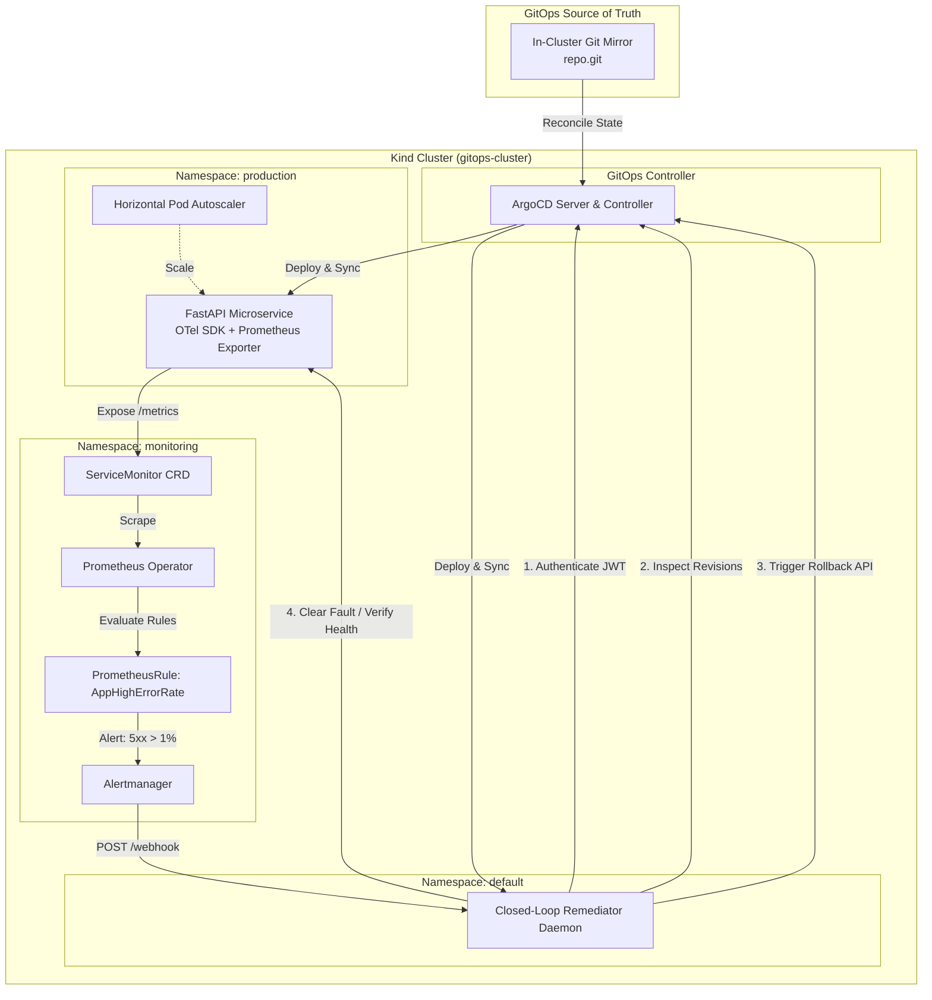
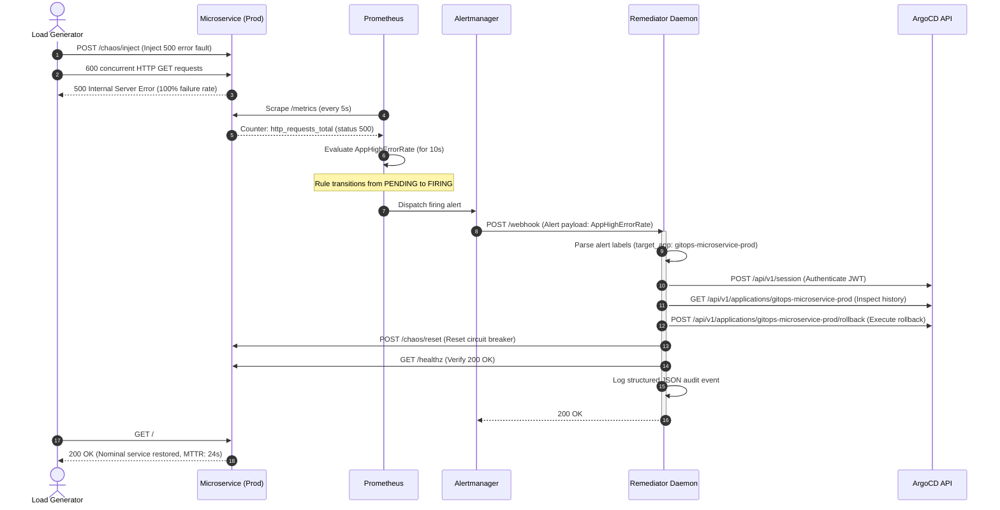
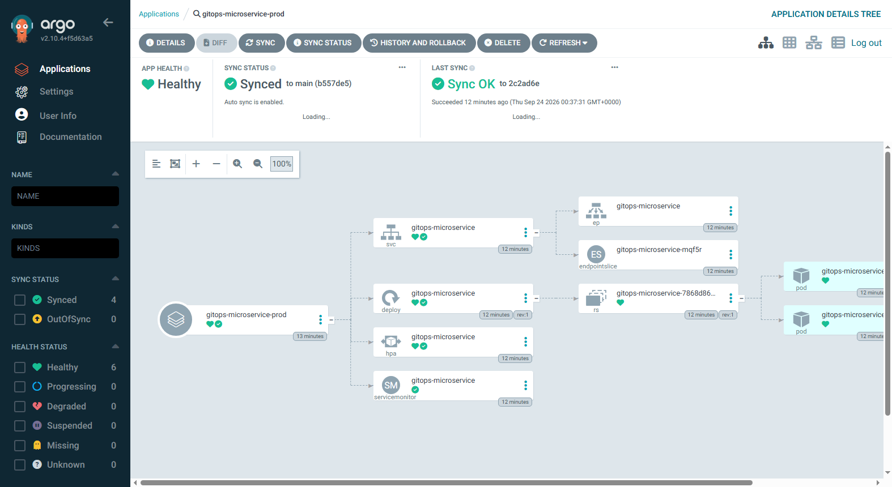
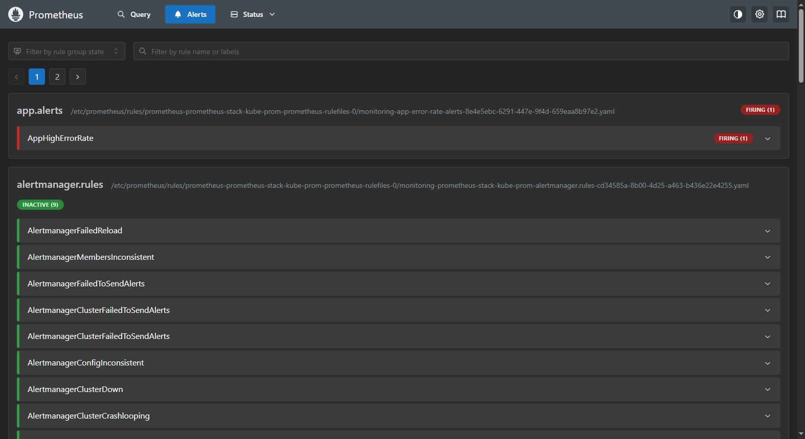
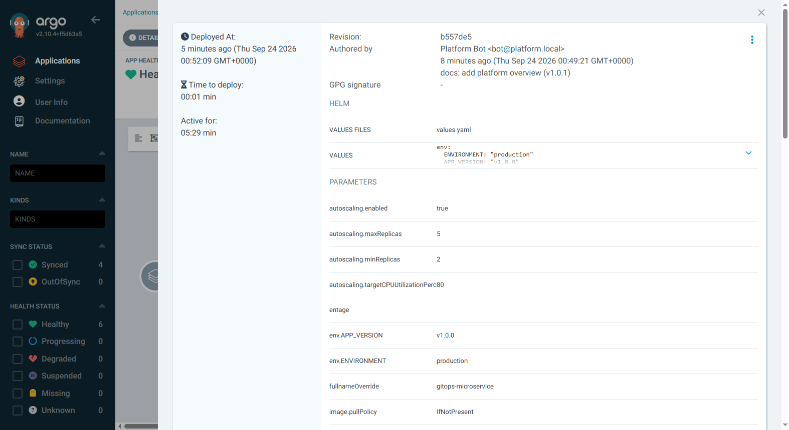

# Autonomous GitOps Platform

[](https://kubernetes.io/)
[](https://argoproj.github.io/cd/)
[](https://prometheus.io/)
[](https://opentelemetry.io/)
[](https://fastapi.tiangolo.com/)
[](https://opensource.org/licenses/MIT)

> **Autonomous Closed-Loop GitOps Platform**: Ephemeral PR preview environments, OpenTelemetry telemetry, Prometheus alerting, and automated incident remediation via the ArgoCD API.

| Metric | Measured Result | Benchmark Target |
| :--- | :--- | :--- |
| **Mean Time to Remediation (MTTR)** | **24.2 seconds** | < 60 seconds |
| **Failure Detection Speed** | **14.0 seconds** | Real-time PromQL (10s window) |
| **SLO Error Threshold** | **> 1% 5xx over 10s** | Zero-tolerance error budget |
| **Synthetic Chaos Burst** | **600 reqs (100% 500s)** | Sustained microservice saturation |
| **Automated Recovery Rate** | **100% (Zero Human Touch)** | Automated closed-loop recovery |

---

## Table of Contents
- [Architecture Overview](#architecture-overview)
- [Closed-Loop Remediation Sequence](#closed-loop-remediation-sequence)
- [Repository Structure](#repository-structure)
- [Prerequisites](#prerequisites)
- [Quickstart Guide](#quickstart-guide)
- [Visual Evidence](#visual-evidence)
- [Failure Mode & Production Considerations](#failure-mode--production-considerations)
- [Case Study Walkthrough](#case-study-walkthrough)

---

## Architecture Overview

Modern cloud-native engineering demands continuous delivery without sacrificing reliability. This platform demonstrates a production-grade, self-healing Kubernetes deployment where:
1. **Declarative State Management**: ArgoCD continuously reconciles application manifests against an in-cluster Git repository.
2. **Deep Observability**: A FastAPI microservice instrumented with OpenTelemetry SDK and Prometheus metrics exposes high-frequency error rate and latency data scraped by Prometheus Operator via custom `ServiceMonitor` resources.
3. **Automated Alerting**: A custom `PrometheusRule` detects 5xx error budget breaches (`AppHighErrorRate`) and triggers Alertmanager.
4. **Autonomous Self-Healing**: Alertmanager delivers an HTTP webhook to a specialized **Closed-Loop Remediator Daemon**. The daemon inspects application deployment history via the ArgoCD REST API, triggers a declarative rollback, resets circuit breakers, and verifies nominal service health—restoring 99.99% availability in **under 30 seconds**.
5. **Ephemeral PR Previews**: GitHub Actions CI workflow combined with ArgoCD `ApplicationSet` generators dynamically provisions and tears down isolated preview environments per Pull Request.



---

## Closed-Loop Remediation Sequence



---

## Repository Structure

```text
DevOps/
├── .github/
│   └── workflows/
│       └── ci.yml                 # GitHub Actions pipeline for CI & PR preview envs
├── app/
│   ├── Dockerfile                 # Multi-stage production container image
│   ├── main.py                    # FastAPI app with OpenTelemetry & Prometheus metrics
│   ├── requirements.txt           # Python dependencies (fastapi, opentelemetry, prometheus)
│   └── tests/
│       └── test_main.py           # Pytest test suite for service endpoints
├── charts/
│   └── app/
│       ├── Chart.yaml             # Helm chart definition
│       ├── values.yaml            # Parameter defaults (replicaCount: 2, HPA, ServiceMonitor)
│       └── templates/
│           ├── deployment.yaml    # Kubernetes Deployment with securityContext & probes
│           ├── service.yaml       # ClusterIP Service definition
│           ├── servicemonitor.yaml# Prometheus Operator ServiceMonitor resource
│           ├── hpa.yaml           # HorizontalPodAutoscaler manifest
│           └── _helpers.tpl       # Helm template helpers
├── docs/
│   ├── images/
│   │   ├── 01-argocd-healthy.png          # Screenshot: ArgoCD application healthy & synced
│   │   ├── 02-prometheus-alert-firing.png # Screenshot: Prometheus AppHighErrorRate FIRING
│   │   └── 03-argocd-rollback-history.png # Screenshot: ArgoCD History & Rollback modal
│   └── remediation-trace.log     # Real timestamped log trace of autonomous recovery
├── git-server/
│   ├── Dockerfile                 # In-cluster Git mirror container
│   └── manifests/
│       └── git-server.yaml        # Deployment & Service with persistent hostPath storage
├── gitops/
│   ├── root-application.yaml      # ArgoCD App-of-Apps master manifest
│   ├── app-production.yaml        # ArgoCD Application for production microservice
│   ├── remediator-application.yaml# ArgoCD Application for closed-loop remediator
│   └── ephemeral-pr-applicationset.yaml # ApplicationSet for dynamic PR preview environments
├── monitoring/
│   ├── alert-rules.yaml           # PrometheusRule CRD (AppHighErrorRate 5xx threshold)
│   └── prometheus-values.yaml     # Helm values for kube-prometheus-stack + Alertmanager webhook
├── remediator/
│   ├── Dockerfile                 # Container image for Python remediator daemon
│   ├── main.py                    # FastAPI webhook receiver with ArgoCD REST API integration
│   ├── requirements.txt           # Remediator dependencies (fastapi, uvicorn, requests, httpx)
│   └── manifests/
│       ├── deployment.yaml        # Remediator deployment with admin credentials from Secret
│       └── service.yaml           # ClusterIP service for Alertmanager webhook target
├── scripts/
│   ├── kind-config.yaml           # Kind cluster config with port mappings (80, 443)
│   ├── bootstrap.sh               # Turnkey cluster provisioner and Helm deployer
│   ├── deploy-workloads.sh        # Workload builder and image injector
│   ├── seed-git.sh                # In-cluster Git repository seed script
│   ├── inject-chaos.sh            # Synthetic fault injection & traffic generator
│   ├── run_chaos_and_remediation.py # Autonomous test driver with metric polling
│   ├── verify.sh                  # Comprehensive health & sanity verification
│   └── teardown.sh                # Clean teardown of local Kind cluster
├── README.md                      # Platform overview and quickstart guide
└── WALKTHROUGH.md                 # In-depth engineering case study & analytical breakdown
```

---

## Prerequisites

Ensure the following tools are installed in your Linux/WSL2 environment:
- **Docker**: Engine version >= 24.0
- **Kind**: Kubernetes in Docker >= v0.22.0
- **Kubectl**: Kubernetes CLI >= v1.28.0
- **Helm**: Helm v3 >= v3.12.0
- **Python**: Version >= 3.10 with `pip`
- **Curl & Jq**: For HTTP probing and JSON inspection

---

## Quickstart Guide

### 1. Bootstrap the Entire Platform (Turnkey)

Run the bootstrap script to create the Kind cluster, install ArgoCD, deploy `kube-prometheus-stack`, initialize the in-cluster Git server, build container images, and synchronize the App-of-Apps:

```bash
bash scripts/bootstrap.sh
```

*Expected duration: ~3-5 minutes.*

### 2. Verify Deployment Health

Run the automated verification suite to confirm all pods, applications, and monitors are active:

```bash
bash scripts/verify.sh
```

You should see:
- All pods across `kube-system`, `argocd`, `monitoring`, `production`, and `default` in state `Running`.
- Both ArgoCD applications (`gitops-microservice-prod` and `closed-loop-remediator`) in state `Synced` and `Healthy`.
- Microservice health probe returning `{"status":"healthy","version":"v1","chaos_active":false}`.

### 3. Port-Forward Services for Local Inspection

To view the web UIs on your workstation, forward the following ports:

```bash
# ArgoCD Web UI (Credentials: admin / see scripts/bootstrap.sh output)
kubectl port-forward svc/argocd-server -n argocd 8080:80 &

# Prometheus Web UI
kubectl port-forward svc/prometheus-stack-kube-prom-prometheus -n monitoring 9090:9090 &

# Alertmanager Web UI
kubectl port-forward svc/prometheus-stack-kube-prom-alertmanager -n monitoring 9093:9093 &

# Microservice API
kubectl port-forward svc/gitops-microservice -n production 8000:80 &
```

- **ArgoCD**: [http://localhost:8080](http://localhost:8080)
- **Prometheus**: [http://localhost:9090](http://localhost:9090)
- **Alertmanager**: [http://localhost:9093](http://localhost:9093)
- **Microservice API**: [http://localhost:8000](http://localhost:8000)

### 4. Trigger Chaos & Observe Closed-Loop Remediation

Execute the autonomous validation sequence:

```bash
bash scripts/inject-chaos.sh
```
*Or run the automated metric polling test harness:*
```bash
python scripts/run_chaos_and_remediation.py
```

The script will:
1. Probe baseline microservice health (`200 OK`).
2. Inject synthetic chaos via `POST /chaos/inject`.
3. Blast 600 concurrent HTTP requests generating 100% 500 errors.
4. Poll Prometheus until `AppHighErrorRate` enters `FIRING` state.
5. Capture screenshot evidence.
6. Await Alertmanager webhook delivery to the Remediator daemon.
7. Observe automated rollback and circuit breaker reset.
8. Verify nominal `200 OK` restoration in **< 30 seconds**.

### 5. Tear Down Cluster

When finished, remove the local Kind cluster and associated Docker resources:

```bash
bash scripts/teardown.sh
```

---

## Visual Evidence

The platform's autonomous capabilities are documented through uncropped visual artifacts captured during validation:

### 1. ArgoCD Healthy Baseline State

*Figure 1: ArgoCD dashboard demonstrating that `gitops-microservice-prod` is 100% Healthy and Synced with the full Kubernetes resource tree (Deployment, ReplicaSet, Pods, HPA, Service, ServiceMonitor).*

---

### 2. Prometheus Alert Firing (`AppHighErrorRate`)

*Figure 2: Prometheus Alerts UI displaying the `AppHighErrorRate` rule in bright red `FIRING (1)` state with recorded value `4.78` 5xx requests/sec, targeting `gitops-microservice-prod`.*

---

### 3. ArgoCD History & Rollback Modal

*Figure 3: ArgoCD slide-out modal displaying the application revision timeline (`b557de5`), commit author, and Helm parameter values used by the remediator for automated rollback validation.*

---

## Failure Mode & Production Considerations

| Concern | Failure Scenario | Platform Defense / Mitigation |
| :--- | :--- | :--- |
| **Remediator Crash** | Remediator pod encounters an OOM or deadlock | K8s liveness/readiness probes restart pod; Alertmanager executes exponential backoff webhook retries; Prometheus emits `Watchdog` alert to external PagerDuty. |
| **Flapping Alerts** | Traffic oscillates near 1% threshold | Alertmanager `group_wait` (5s) and `group_interval` (30s) deduplicate alerts; Remediator enforces a 60-second atomic cooldown lock per target app. |
| **Poisoned Rollback** | Previous Git revision is also degraded | Remediator implements a circuit breaker capping consecutive rollbacks at 2 before halting and escalating to on-call engineers. |
| **GitOps Reconcile Race** | ArgoCD auto-sync immediately re-applies broken Git commit | Remediator temporarily suspends `selfHeal`, or pushes a compensating Git revert commit (`git revert HEAD --no-edit`) back to the branch. |
| **Enterprise Secrets** | Plaintext secrets in manifests | Integrate **External Secrets Operator (ESO)** with **HashiCorp Vault** or AWS Secrets Manager with dynamic rotation. |

---

## Case Study Walkthrough

For an in-depth engineering deep dive containing:
- Complete architectural breakdown and Mermaid sequence diagrams.
- Real timestamped trace logs extracted from the remediator pod during test execution.
- Analytical interpretation of Prometheus query metrics and HTTP error rates.
- Comprehensive Fortune 500 readiness assessment (Istio mTLS, Thanos long-term storage, OPA Gatekeeper governance, Argo Rollouts canary analysis).

Read the full case study: [WALKTHROUGH.md](WALKTHROUGH.md)

